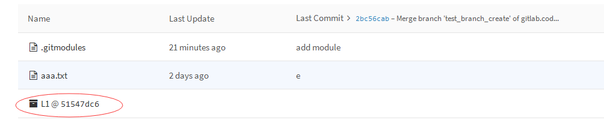
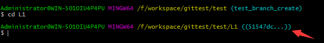
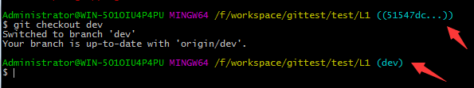
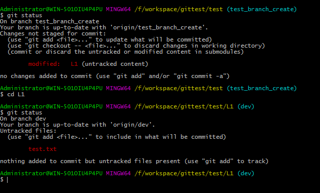
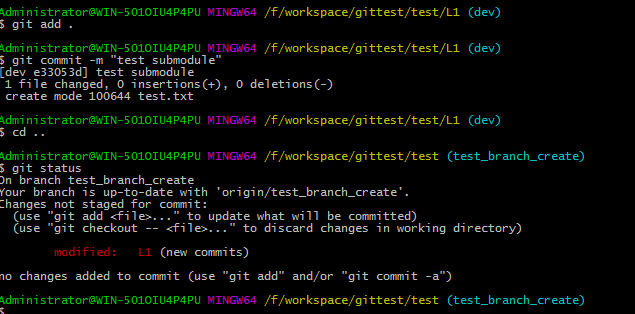

# Git子模块相关

 [原文](https://www.jianshu.com/p/704d359d4350)

 

## 添加子模块

如果项目分的模块比较多，而且对每个模块需要独立管理的话，子模块就派上用场了。每一个子模块都是一个独立的git仓库，有点类似于svn的外链。下面简单讲一下在现有的git仓库里添加子模块的配置。


> 在主项目中添加子模块

```
git submodule add git@gitlab.code.anzogame.com:octopus/L1.git
```

这就完啦？对，就这么简单，回车后就会自动clone子模块的最新代码下来，并命名为L1，当然也可以重命名，只需要在命令后面跟上需要重命名的名字即可。


## 子模块的使用

> clone带子模块的项目，前提是对子模块的仓库是有相应权限的

```
//方式一
git clone --recursive <url>

//方式二
git clone <url>
git submodule init
git submodule update
```

其实主项目只是保存了一个子模块的地址和对应的commit号，如下图：




**注意这里只指向子模块仓库的某一个版本，一般情况下并不会特别指向某一个分支，clone代码的时候是把这个版本的代码clone下来了(不一定的子模块最新的代码)。**如下图：




不在分支上的本地工作区是不能提交同步代码的，所以这里如果后续需要对子模块修改提交并同步的话，是需要手动切换都某一个分支的，如下图：




> 对子模块内容做修改后的提交

* step1：当我们对子模块做了修改，比如我在L1子模块做了修改，此时查看状态：



 注意看红色L1后面的状态，`untracked content`的意思是L1子模块里有内容修改，并且这个修改并没有被加入版本管理里。 

* step2：此时我对cd进入子模块里进行`commit`，主项目里的子模块的`commit`号就会随之改变，再看一下状态：



此时L1后面跟的是`new commits`，这代表主项目所保存的子模块的版本号已经改变了，你需要将这个版本号在主项目也提交才行，不然就会出现不匹配的状态。 


* step3：这个时候就应该先`cd`进入子模块进行`push`,同步真正修改的内容到远程仓库，然后再回到主项目`push`，就是同步推送主项目指向子模块的`commit`号到远程仓库。


这里有个坑，大家刚开始的时候会经常遇到。`甲同学`对L1子模块进行了修改并且同步到远程仓库了，但是没有提交主项目对这个子模块的版本号，这时`乙同学`对子模块L1进行了单独的更新，这个时候问题就出现了，`乙同学`在主项目`git status`查看状态的时候会出现L1是红色的，并且是[new commits]状态，**这是因为乙同学主项目里L1子模块的版本号已经变了，子模块的版本号只由当前子模块的最新commit号决定，也就是HEAD指针指向的commit号。**所以这个时候需要请`甲同学`提交一下，如果不提交问题也不大，`乙同学`自己提交上去，只是这个时候`甲同学`再提交会出现L1的这commit号冲突，因为对于主项目来说这个子模块版本号两个人都做了修改，但是这个可以不解决，因为这个commit号是手动改不了了，也就是说不用解决这个冲突，保持最新就好。但是冲突总是大家不想遇到的，所以在对子模块有修改的时候尽量都把对应的主项目的版本号也提交上去，这才是最正确的操作。


> 多个子模块简便操作

当遇到一个功能需要多个子模块都同时做了修改，那么相应的对这几个子模块都要做一次提交，这个时候如果一个一个的cd进去再提交同步就会是个非常麻烦的事情，程序员都是懒得。这个时候用下面这个命令就可以完美解决：

```
git submodule foreach "<git command>"
```

他会对子模块一个一个的执行尖括号里的命令，例如`git submodule foreach "git push"`