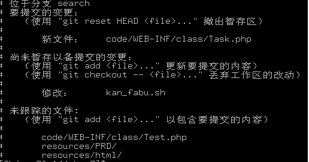
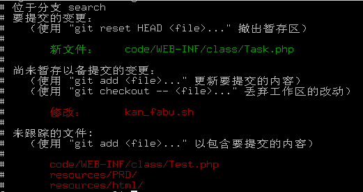

# Git配置文件


## 一、配置文件的存储位置

git相关的配置文件有三个：

1. ` /etc/gitconfig`：包含了适用于系统所有用户和所有项目的值。==system==
2. `~/.gitconfig`：只适用于当前登录用户的配置。 ==global==
3. `.git/config` : 位于git项目目录中的，适用于特定git项目的配置。==local==

对于同一配置项，三个配置文件的优先级是1<2<3


### 全局配置

例如用户名，邮箱等，位于文件：

> ~/.gitconfig

例如Windows下，则是

> C:\Users\lanyang\.gitconfig

### 各个仓库的配置

在仓库目录下

> .git/config

例如orange仓库目录下

> /home/lanyang/orange/.git/config

以上的配置都可以通过命令查看

```
$ git config -–list 
```


## 二、一些有用的配置项

1.[alias] 为git命令配置别名，例：

```
[alias]
    st = status
    ci = commit
    br = branch 
```

当你有了上述配置后，使用`git st`等同于使用`git stauts`

2. [color] 设置git输出着色，例：

```
[color]
    ui = true
```

设置`color.ui`为true来打开所有的默认终端着色。

对比一下，无此配置时

 

加入配置后



3. core.filemode 让git忽略对文件权限的修改

```
[core]
    filemode = false
```

4. 使用vimdiff呈现Git diff差异

```
[diff]
    tool = vimdiff
[difftool]
    prompt = false
[alias]
    d = difftool
```

使用时只需将用到git diff的地方换为git d就可以了。

 

## 三、用git config操作配置文件

**1. 列出当前配置项**

`git config [–system|–global|–local] -l`

使用system, golbal, local时，分别列出对应一部分中的1，2，3三个文件之一的配置项。

如果不加上述三个选项，则会按一部分中所说的优先级合并所有配置项并输出。

**2.添加配置项** 

`git config [–local|–global|–system]  section.key value`

例：

```
git config core.filemode true 
```

执行后会在配置文件中添加 

```
[core]
    filemode = true
```

**3.删除配置项** 

`git config [–local|–global|–system] –unset section.key`


----


## 四、windows下配置git默认编辑器

[原文](https://blog.csdn.net/coolcaosj/article/details/20089255)

在windows上使用git的时候，在配置全局编辑器的时候遇到一点问题，现将解决办法如下，
在.gitconfig中做如下配置：

```
[user]
	name = coolcao
	email = coolcao2010@gmail.com
[core]
	editor = "c:/Program Files (x86)/Vim/vim74/gvim.exe"
```

可是在使用的时候却提示如下错误： 

```
error: cannot spawn gvim: No such file or directory
error: unable to start editor 'gvim'
Please supply the message using either -m or -F option.
```

 上网查得知，原来git config貌似移出了一层引号，因此加上便可，如下即可： 

```
[user]
	name = coolcao
	email = coolcao2010@gmail.com
[core]
	editor = "\"c:/Program Files (x86)/Vim/vim74/gvim.exe\""
```

注意： 路径 必须是正斜杠 `/` 

当然，如果你的终端配置了vim的环境变量，完全可以 editor=vim   ，直接在终端里面调用vim即可，只是Windows的终端字体太难看了，没法更改（或者我不会，也不愿改了），不如使用图形化的gvim看起来舒服。 


----

## 五、解决git中文乱码

[原文](https://www.cnblogs.com/timsheng/p/4595173.html)


和linux平台一样，在默认设置下，文件名称中包含中文的文件，在工作区状态输出、查看历史更改概要，以及在补丁文件中，文件名中的中文不能正确的显示，而是用若干八进制字符编码来显示，如下：

```bash
 git status -s
 ?? "\350\257\264\346\230\216.txt"
```

```bash
 printf "\350\257\264\346\230\216.txt"
 说明.txt
```

配置变量 core.quotepath 设置为false就可以解决中文文件名在这些Git命令输出中的显示问题。

```bash
 git config --global core.quotepath false
 git status -s
 说明.txt
```

 


## 参考阅读

[^1]: [git配置文件](https://blog.csdn.net/qmhball/article/details/46380101)

[^2]: [git 的配置在哪](https://blog.csdn.net/lanyang123456/article/details/78011815)

[^3]: [windows下配置git默认编辑器](https://blog.csdn.net/coolcaosj/article/details/20089255)

[^4]: [解决git中文乱码](https://www.cnblogs.com/timsheng/p/4595173.html)